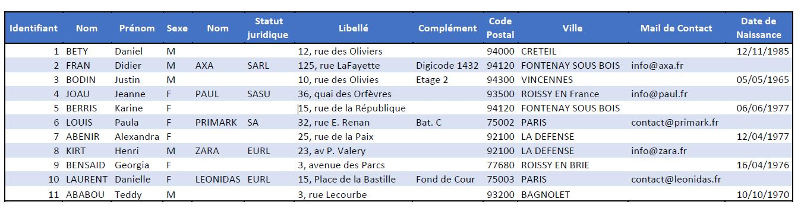

# ProjectCPP
Projet CPP pour la formation C/CPP embarqué


Au travers de ce projet, vous reverrez beaucoup de points abordés au sein du cours C++. Il s'agit de créer un annuaire dans lequel seront stockés des contacts.
Le projet sera décomposé en plusieurs parties.

```
- PARTIE 1 : GESTION DES CONTACTS
- PARTIE 2 : CREATION DE L'INTERFACE
```

# PARTIE 1 : GESTION DES CONTACTS
## On distingue différents types de contacts :
- Des contacts « Privés »
- Des contacts « Professionnels »
## Pour l’ensemble des contacts, on distingue les caractéristiques suivantes :
- Identifiant (Numérique)
- Nom (Chaine de 30 car. en majuscule)
- Prénom (Chaine de 30 car. Première lettre en majuscule)
- Sexe (F/M)
## Pour les contacts Privés, on stockera les informations suivantes :
- Adresse postale
- Date de Naissance
## Pour les contacts Professionnels, on stockera les informations suivantes :
- Nom de l’entreprise (Chaine de 50 car. en majuscule)
- Statut Juridique (SARL, SA, SAS, EURL)
- Adresse de l'entreprise
- Adresse Mail (Chaîne contenant un @)
```
Toute adresse est composée du Numéro, Rue, Complément, Code Postal et Ville. On considérera que l'ensemble des Contacts est Français.
Créer dans un premier temps une application console vous permettant de tester la hiérarchie mise en place.
Vous joindrez le diagramme de classes associé à votre hiérarchie.
```

# PARTIE 2 : CREATION DE L'INTERFACE CONSOLE
De plus, vous constituerez une application console utilisant la hiérarchie préalablement constituée.
Cette application offrira à l’utilisateur la possibilité de :
- Lister les contacts privés et/ou professionnels en respectant certaines contraintes au niveau de l’affichage (cf. Annexe)
- Recherche à partir de certains critères :
o Par Numéro
o Par Nom
o Par Code Postal
o Par Département
o Par Ville
- Ajouter un contact quel qu'en soit le type
- Modifier/Supprimer un Contact via son identifiant

# Plus

```
Si vous avez le temps, vous prévoirez l’exportation des contacts Pro et Privés vers des fichiers pros.dat et/ou privates.dat.
Pour l’ensemble des fonctionnalités, vous afficherez un message d’erreur en cas d’échec.
Constituez une interface simple et conviviale.
```

# CONTRAINTES TECHNIQUES
D’un point de vue technique, on devra retrouver, au sein de votre code, les concepts suivants :
- Héritage
- Surcharge d’Opérateurs
- Composition/Agrégation
- STL
- Exception
- Espaces de nom

## A la fin du projet, vous mettrez dans la section Travaux
- Diagramme de Classes
- Un projet zippé

# Exemple de jeu de données :



# Note

```
Les développements et les tests sont réalisés en totalité sous codeBlocks pour windows 10

Les tests en ligne de commande sont réalisés sous Debian 11
```
